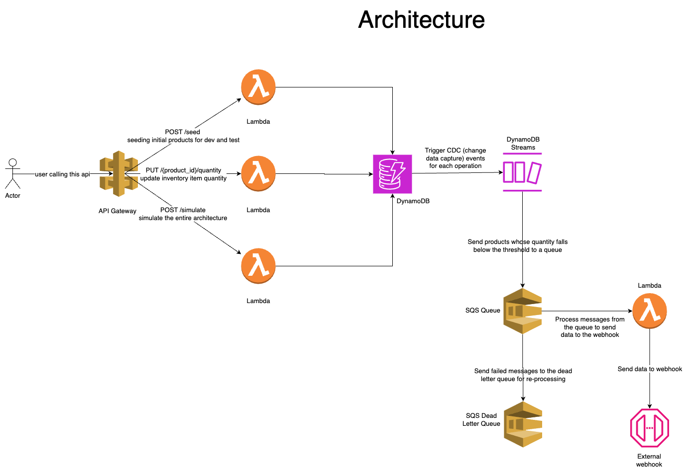

# Case Study

The `cdk.json` file tells the CDK Toolkit how to execute your app.

## Architecture Diagram

This is how the architecture looks like for this case study:

- This architeture exposes an enpoint via API Gateway to update the product quantity. The endpoint is handled via a Lambda that updates the product quanity stored in a DynamoDB table
- When a product quantity is updated, DynamoDB triggers an event via DynamoDB streams which is handled by a Lambda that filters the products whose quantity is below the threshold limit to an SQS queue
- Another lambda is configured to consume messages from the queue and send it to an external webhook. This is configured in such a way that if the webhook response fails, it will send this to a DLQ for re-processing

## Prerequisites

- Node LTS (v20 or above)
- PNPM
- AWS CLI with credentials configured (e.g. `aws configure`) and use the highest level of permissions for local development
- Postman (optional)

## Setup

- Clone this repository
- Install the dependencies: `pnpm install --frozen-lockfile`
- Check if the AWS credentials are working: `aws sts get-caller-identity`
- Open Postman and import the collection from the root of this project [CaseStudy.postman_collection.json](./case-study.postman_collection.json)
- Rename the `.env.example` file to `.env` and fill the `AWS_ACCOUNT_ID` with the account ID you want to deploy to. This is a required step else the deployment will fail
- Run `pnpm cdk deploy --watch` to deploy the stack locally and get live logs
- The outputs section will specify the URL that we can use to interact with the API
- Copy this URL and add it to the `http-api-url` environment variable in Postman to run the APIs in the newly imported collection

## Endpoints

- POST `/seed` - Seed the database with the initial product inventory. This endpoint will remove all exisiting items and seed the initial items. Only should be used in dev and test environments. The response will either be a successful message or an error with the appropriate status code and error message.

- POST `/{product_id}/quantity` - Set the quanity of a given product (`product_id`) in the inventory. The request body should contain the following keys:

  - `type` (enum) - Should be one of the following values: `increment`, `decrement` or `set`
  - `value` (number) - Should be a positive integer

  - The response will either be a successful update of the product quantity or an error with the appropriate status code with any valdidation issues if they occur

- POST `/simulate` - This endpoint will simulate the entire flow with a dummy product for how the notifiation gets sent to the external webhook system. This is a good way to test the flow and the output of the entire flow can be seen in the terminal after running `pnpm cdk deploy --watch`

## Useful commands

- `pnpm build` compile typescript to js
- `pnpm watch` watch for changes and compile
- `pnpm cdk deploy` deploy this stack to your default AWS account/region
- `pnpm cdk deploy --watch` deploy this stack to in watch mode to update lambdas and view logs in realtime
- `pnpm cdk diff` compare deployed stack with current state
- `pnpm cdk synth` emits the synthesized CloudFormation template
